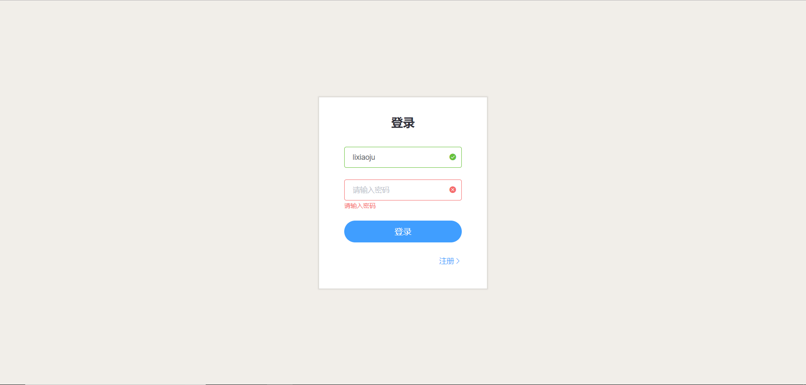
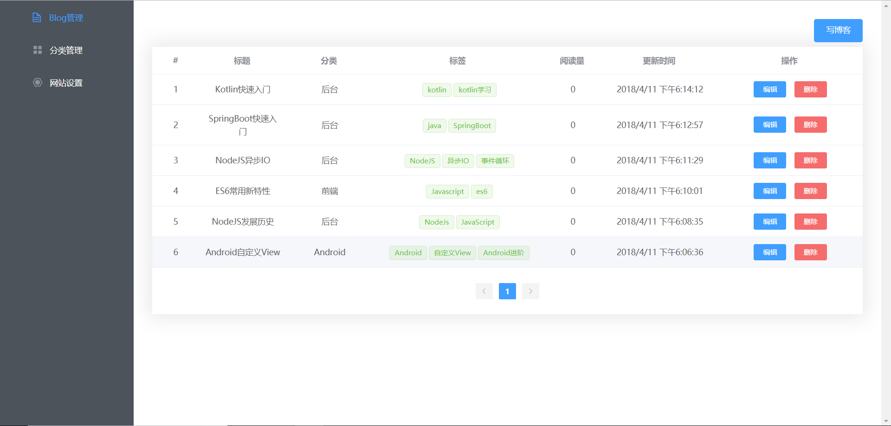
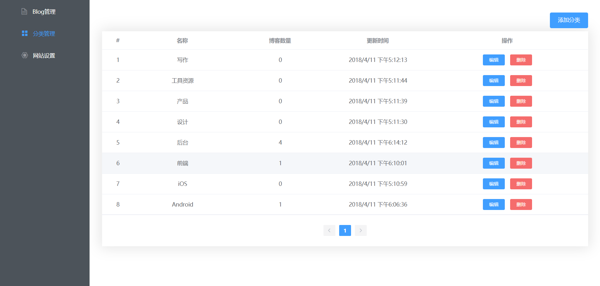
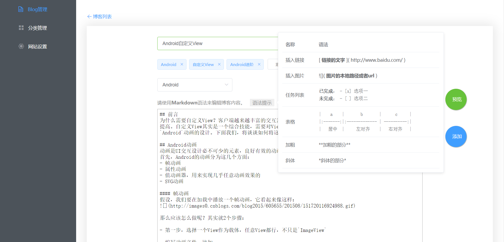
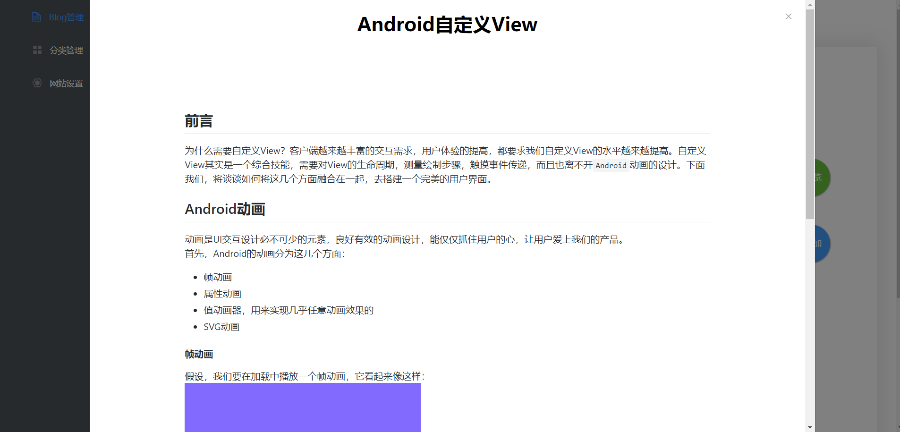

# QingBlog前端

基于Vue2套件，Axios, ElementUI编写的单页应用。


## 管理后台截图







## 构建步骤

``` bash
# install dependencies
npm install

#
npm start

# build for production with minification
npm run build

# build for production and view the bundle analyzer report
npm run build --report
```

